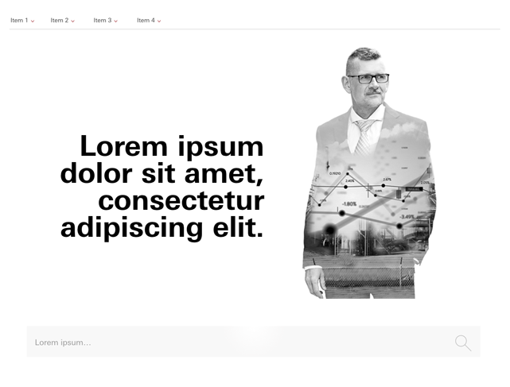

# Vanguard Test

Take home web page project.

## Requirements 

1. Pick 1 of the 2 flat designs in the file and create a web page.

2. Try to complete within 24hrs of starting.

2. Send back in a GitHub.

## Design

## Technologies Used

* HTML
* CSS Grid
* SASS

## Notes

* I chose not to use a framework in order to reduce the size of assists downloaded, increasing page speed. The resulting page is around 218 KB, whereas Bootstrap itself is close to 671 KB.
* I laid out the page using CSS Grid to simplify the layout by using the declarative syntax. Using this modern technology trades off ease of development for older browser support.

